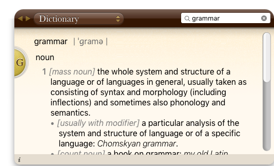
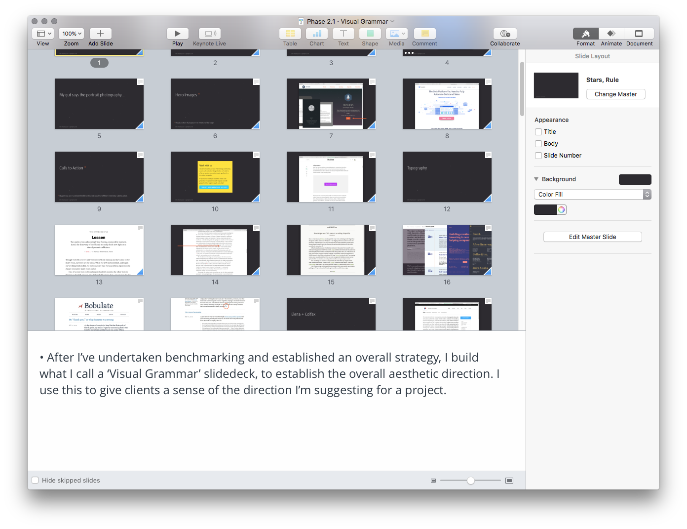

Hop Onboard
===========

An Open Source Client Onboarding Process
----------------------------------------

**Last Update: 24 August, 2018**

I developed this repository to accompany an article on ‘Building a Business’ that I was commissioned to write for Net magazine (Issue 312; October, 2018). I hope others find it useful.

This process represents the culmination of 25+ years of work as a [designer][01] working with both clients and agencies. It’s my methodology and, as such, it might not fit every situation, but I find it a useful approach to ensure that the projects I undertake are managed efficiently.

I use this structure to inform my teaching on Belfast School of Art’s BDes (Hons) Interaction Design programme, ensuring that my students are industry ready and have an understanding of the systems and processes typical studios use.

Although my process is structured with a number of phases, these phases often run concurrently and everything is developed iteratively.

I work very closely with the team at [Little Thunder][02], a boutique experience design company based in Belfast, so this process reflects the methodologies we share when we work together. (If you’re looking for a studio to work on a digital product, I’d recommend them in a heartbeat.)

Finally, I’m using this onboarding process as the backbone for a new book – provisionally titled ‘Designing Delightful Experiences’ – which focuses on the user experience design process from start to finish. The book is scheduled for release in late 2018. If that sounds interesting to you, [you might like to follow me on Twitter][03].

- - -

Table of Contents
-----------------

+ Phase 1: Benchmarking and Strategy
+ Phase 2: Visual Grammar; and Voice and Tone
+ Phase 3: Content Design and Copywriting
+ Phase 4: Sitemap and Wireframes
+ Phase 5: Element Collages and Mockups
+ Phase 6: Clickable and HTML Prototypes

- - -

Phase 1: Benchmarking and Strategy
----------------------------------

After an initial client workshop, the first phase of my process is to undertake some benchmarking so that I can develop a strategy informed by considered research.

In this phase, which often involves defining a core brand message (for either a business or a product), I’ll undertake benchmarking, looking at competitors and defining the lay of the land.

With this research in hand, I’ll then develop a strategy: a bespoke approach that’s tailored to each individual project. I’ll also establish some goals so we can measure the validity of our assumptions.

<!--

I haven’t done much on the ‘Establishing Goals’ section and I should. What are the KPIs? They should drive the design.

Design isn’t just ‘pretty’ it’s at the service of goals. KPIs right up front. How will you know if the design’s successful?

Think of this for the UX book and LT documentation.

-->

### Benchmarking

The projects I work on are more often than not confidential in nature, so I can’t share the assets I develop for them. However – in the spirit of ‘show, don’t tell’ – I think it’s useful to show examples from a project I **can** share.

<!-- This might be moved upfront? It seems like a bigger picture reference about the whole repository. -->

As the backbone of this repository I’m sharing the process I used as I developed the presence for my new business: [Mr Murphy Ltd.][01].

This project is just like any other, it takes a business (in this case, mine) and maps out the deliverables I’ve developed at every stage of the process.

I find it’s useful at the start of a project to establish benchmarks. For Mr Murphy Ltd., I undertook research into a variety of competitors, both individuals and businesses.

In my business I find it easiest to run workshops for clients, using Keynote as a tool to map everything out. I plan to include links to these keynotes here and will supply them when they’re finished.

/* I have a benchmarking and strategy deck, which I need to tidy. Although it’s a little awkward sharing my innermost thoughts and hopes, I think this would be useful for others to see, so I’ll share it when the slidedeck’s notes are cleaned up. */

### Strategy

With research in hand, it’s time to define a strategy…

Usually if I’m working with a business they’ll have some goals in mind, something they’d like to achieve with the project. If they don’t have goals, I’ll work with them to establish some, otherwise, it’s very difficult to measure success.

In the case of Mr Murphy Ltd., it’s a company of one (more accurately two: Mr and Mrs Murphy), but this methodology can be applied to a business of any size.

I tie the strategy to a set of goals that allows us to test our assumptions. These goals – or Key Performance Indicators (KPIs) to use a technical term – allow me to measure success.

/* I’ll provide this deck shortly. */

- - -

Phase 2: Visual Grammar; Voice and Tone
---------------------------------------

With some benchmarking undertaken and an outline strategy established, the second phase of my process is to begin defining an overall aesthetic, both visual and verbal. I do this in two, related passes: considering the visual grammar (how everything looks); and the voice and tone (how everything sounds).

### Visual Grammar

My ‘Visual Grammar’ slidedeck explores a high-level design approach, pinpointing a ‘look and feel’ and an art direction for the project in hand. I use this slidedeck to brief the various designers on the project, so that they have a clear direction and are, importantly, all referring to a single source.

This approach is similar to Dan Mall’s ‘Visual Inventory’ (which I was delighted to discover recently), but I’ve always named my deliverable ‘Visual Grammar’. Mall’s thoughts on this are well worth reading and he has, ever-helpfully, written [an article outlining his approach][04].

A grammar is defined as a system of a language – a set of forms and a series of rules governing their usage – and my visual grammar deck is designed to tease out the building blocks of a design in a systematic manner.

My visual grammar slidedeck is usually broken down into the following sections:

+ Information Architecture (IA)
+ Landing Pages
  + Overall Inspiration
  + Hero Images
  + Calls to Action
+ Typography
  + Overall Inspiration
  + Macro (At the page level.)
  + Micro (Focussing on the details.)
+ Branding /* Move this up? */
+ Imagery
+ Colour Palettes

/* Include a link to the completed deck here. Upload it to Slidedeck also. */

### Voice and Tone

Every project – no matter how large or small – will benefit from some consideration of voice and tone.

Language, both verbal and visual, is an important part of what we shape as designers and it’s important to establish some benchmarks on the kind of voice and tone that will be used.

After undertaking some research, which will include a content audit, I’ll develop a ‘brand dictionary’ for every project. This ensures that the language that underpins the design is considered holistically.

/* I’VE MADE IT THIS FAR, THE REST IS SCRATCH CONTENT AND THIS SECTION NEEDS WORK. */

- - -

Phase 3: Content Design and Copywriting
---------------------------------------

It’s almost impossible to design without content. What we design and build as designers involves content of one form or another, as such it’s important to proactively design content as an integral part of our process.

Using placeholder copy, like lorem ipsum, is – in my (strongly held) opinion pointless. I’ll not dwell on the point, as [I’ve written about it before][LI], suffice to say: content matters.

Words – and other forms of content – are an essential part of the design process, indeed words, when written well, can be the design itself. I’ve written two short books on the subject, for Five Simple Steps, which are still [available][CW].

Well-written and well-crafted content can capture the attention of the reader, allowing words to speak. Equally, other forms of content, like images or video, also play a role in design.

### Content Design

Everything we shape as designers is content of one form or another. Without content, we wouldn’t have much to design. Content is often left until the end of the process, in the expectation that the client will deliver it, ready packaged and all set to go.

In my experience, clients rarely deliver the content on time, so I find it helpful to take a proactive role in developing content and **designing it**. Sarah Richards – who led GOV.UK’s Content Design team – has written the definitive book on content design. Every designer should own a copy and I strongly recommend reading it.

### Copywriting

Copy goes here.

- - -

Phase 4: Sitemap and Wireframes
-------------------------------

High level explanation outlining what this phase is about.

### Sitemap

Copy goes here.

### Wireframes

Copy goes here.

- - -

Phase 5: Element Collages and Mockups
-------------------------------------

High level explanation outlining what this phase is about.

### Element Collages

Copy goes here.

### Mockups

Copy goes here.

- - -

Phase 6: Clickable and HTML Prototypes
--------------------------------------

High level explanation outlining what this phase is about.

### Clickable Prototypes

Copy goes here.

### HTML Prototypes

Copy goes here.

- - -

In Closing
----------

As I’ve noted in the [README][RM], this file is currently in progress (as of 12 August, 2018), I’ll be adding to it over the coming days and weeks while I work on the article. If you’d like to be notified when it’s finished, [you might like to follow me on Twitter][TW].

—Christopher

<!-- Links (Add link titles at the end so I can educate quotes.) -->

[01]: http://mrmurphy.com

[02]: https://littlethunder.co

[03]: https://twitter.com/fehler

[04]: http://v3.danielmall.com/articles/visual-inventory

[LI]: http://www.webstandardistas.com/2009/03/ban-lorem-ipsum.php

[CW]: https://gumroad.com/l/WKvpI

[RM]: https://github.com/fehler/client-onboarding/blob/master/README.md